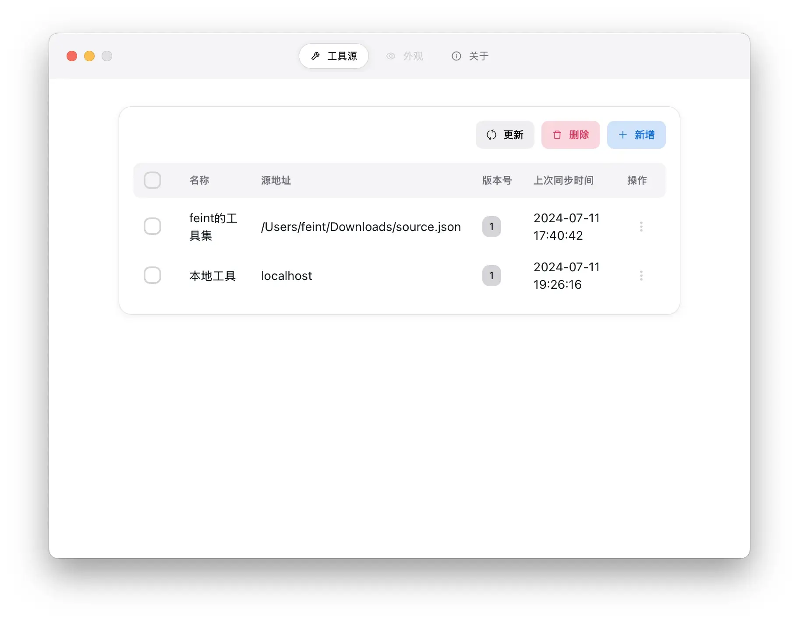
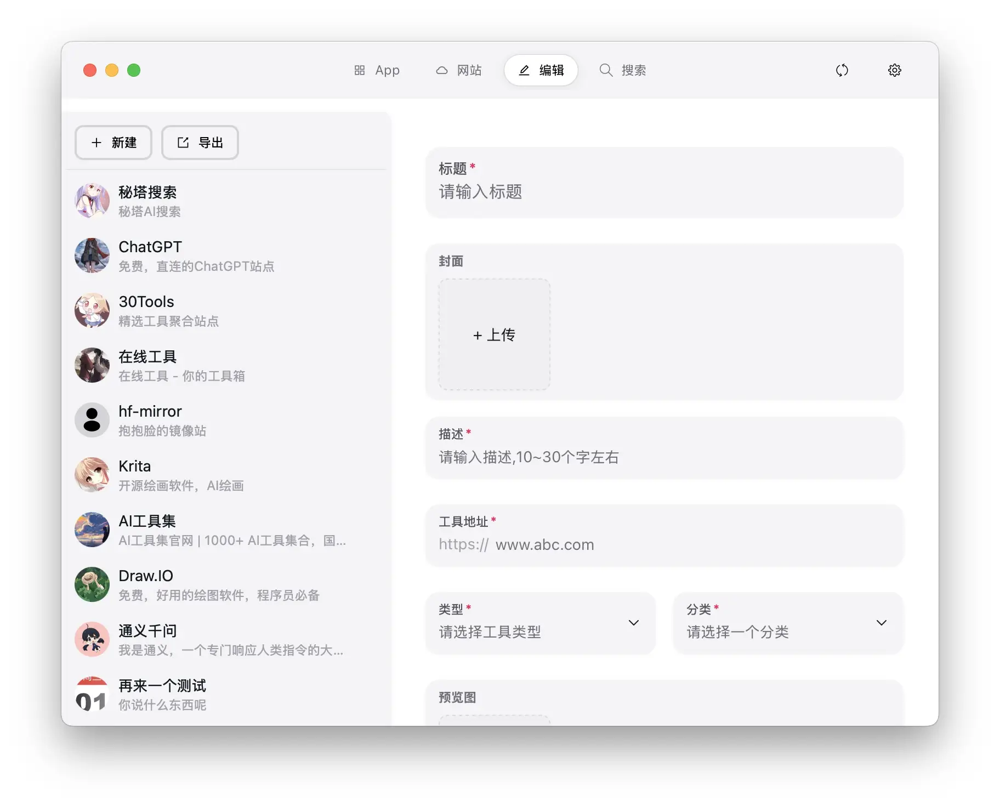
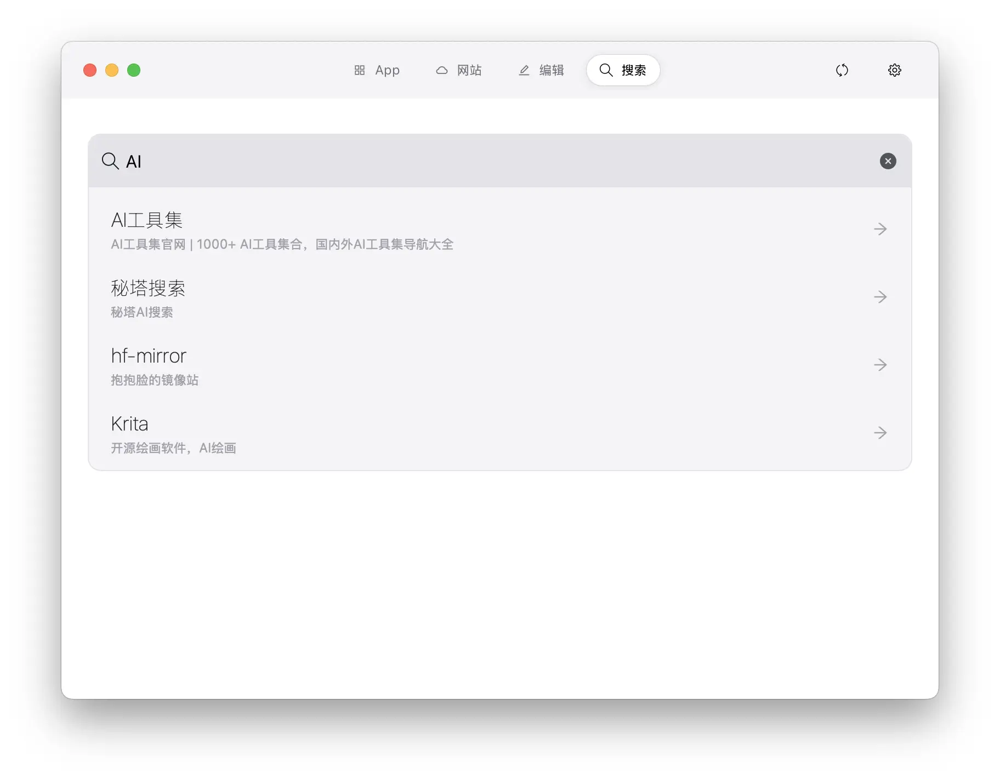
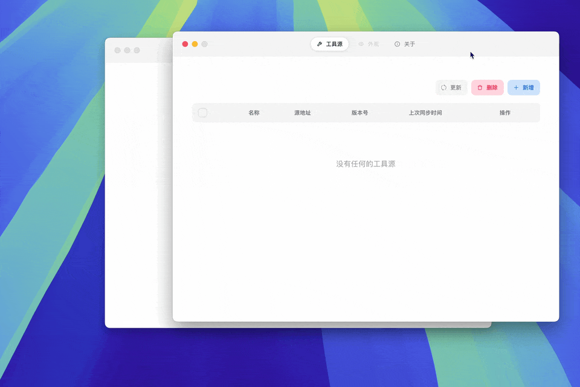
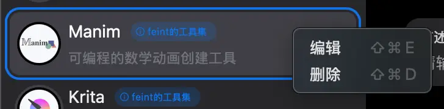

# myTools

> 一个基于 `Next.js` + `Tauri` 构建的工具网站管理工具。
>
 
这个App的目标是能过可持续的为大家分享免费好用的工具网站。对我来说做成一个离线工具相比与一个资源聚合站点有以下几个优势：

1. 更加可持续的方式。不需要负担额外的服务器费用；
2. 可以做更多自定义的功能，更加方便快捷的使用；
3. 大家都可以分享自己使用的软件或网站

### 界面展示

|  | |
| --- | --- |
|  |  |

### 开始
1. 下载[配置文件](./statics//tools-export.json)
2. 点击窗口右上角的设置（⚙️）按钮，然后按照下图进行操作
3. 

### 规范
1. 封面大小：600x400
2. 预览图大小：1200x800
3. 图片格式：webp，质量70
4. 工具说明支持`Markdown`语法，仅支持插入在线图片。
5. 封面中如果展示软件图片，则图标尺寸为：225x225，背景色推荐色号：`#F7F8FC`

### 开发任务
| 任务 | 状态 | 优先级 | 预览|
| --- | --- | --- | --- |
| 支持单个工具的删除，使用contextWindow | ✅ | 1 | |
| 在线工具源的下载和导入 |  | 1 ||
| 工具源的更新|| 2||
| 工具快捷面板窗口，全局快捷键唤起 |  | 2 ||
| 完善设置页面 || 2 ||
| 页面加载动画使用骨架屏||3||
| 增加必要的系统菜单和Tray| | 3||
| 实现快捷指令 ||3||
| 多语言支持|| 4||
| windows,Linux兼容性测试|| 4||

### Bug记录
